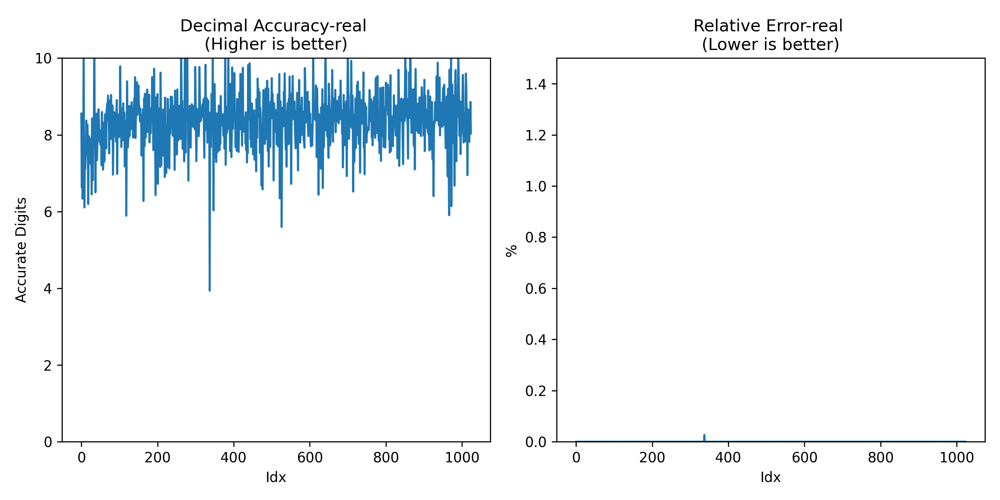
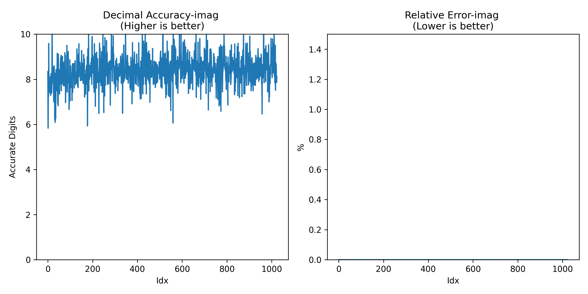
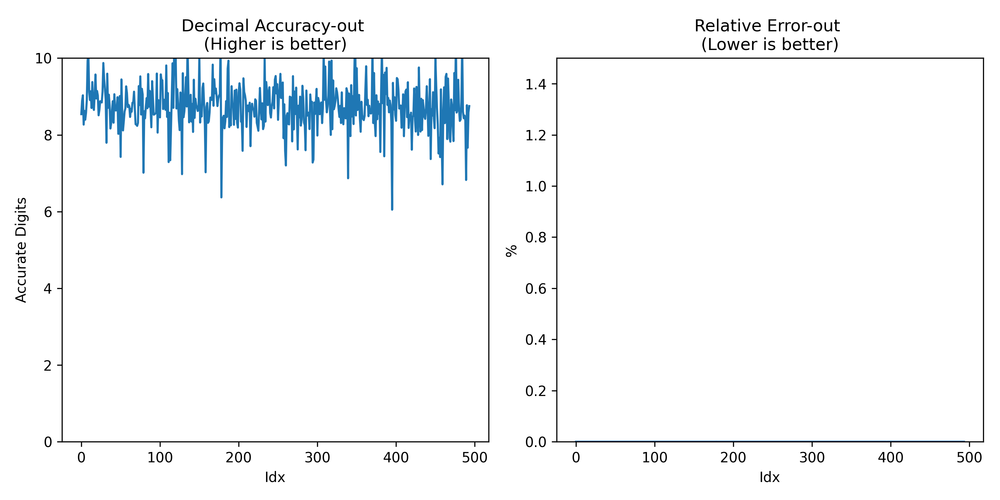

# Calyx Posit Evaluation

This repository contains the code for evaluating the Calyx binding of the [Chisel HardPosit](https://github.com/thoughtworks/hardposit-chisel3) units.

We created a fork of Dahlia which emits Posit 32 units when `floats` are used. The following benchmarks from the [Machsuite](https://github.com/breagen/MachSuite) are rewritten in [Dahlia](https://github.com/cucapra/dahlia).

1. FFT Strided
2. SPMV CRS
3. SPMV ELLPACK
4. Viterbi

## Instructions to run the benchmarks

```
# Build the fork of Dahlia
git clone https://github.com/Mark1626/dahlia.git
pushd dahlia
git checkout float-support
sbt assembly
popd

# Generate the hardposit blocks
# Refer to https://github.com/thoughtworks/hardposit-chisel3/blob/master/lib/README.md
git clone https://github.com/thoughtworks/hardposit-chisel3.git
pushd hardposit-chisel3
sbt run gen P32 full
cd lib
# Generate a single SV file from each module
make
popd

# Add the compiled Posit units within calyx
git clone https://github.com/cucapra/calyx.git
pushd calyx
cp ../hardposit-chisel3/lib/*.sv .
cp ../hardposit-chisel3/lib/*.futil .
fud config --create global.root $PWD
popd

# Clone and run the benchmarks
git clone https://github.com/dic-case-studies/calyx-posit-evaluation
cd calyx-posit-evaluation

# Install the utilities
pushd utilities/python; pip3 install -e .; popd
pushd utilities/cpp; cmake -B ./build/ -S .; make -C build; popd

# Run the benchmarks
make all
```

## Results

1. FFT Strided




---

2. SPMV CRS



---

3. SPMV ELLPACK


---

## Acknowledgement

This work was done by

1. [M. Nimalan](https://github.com/Mark1626)
2. Swethaa. A
3. Addhanki Venkata Sai Veera Manikanta
4. Maneesh Sutar

The benchmarks are from [MachSuite](https://github.com/breagen/MachSuite). The following paper describes the MachSuite benchmarks:

> Brandon Reagen, Robert Adolf, Sophia Yakun Shao, Gu-Yeon Wei, and David Brooks.
> *"MachSuite: Benchmarks for Accelerator Design and Customized Architectures."*
  2014 IEEE International Symposium on Workload Characterization.
